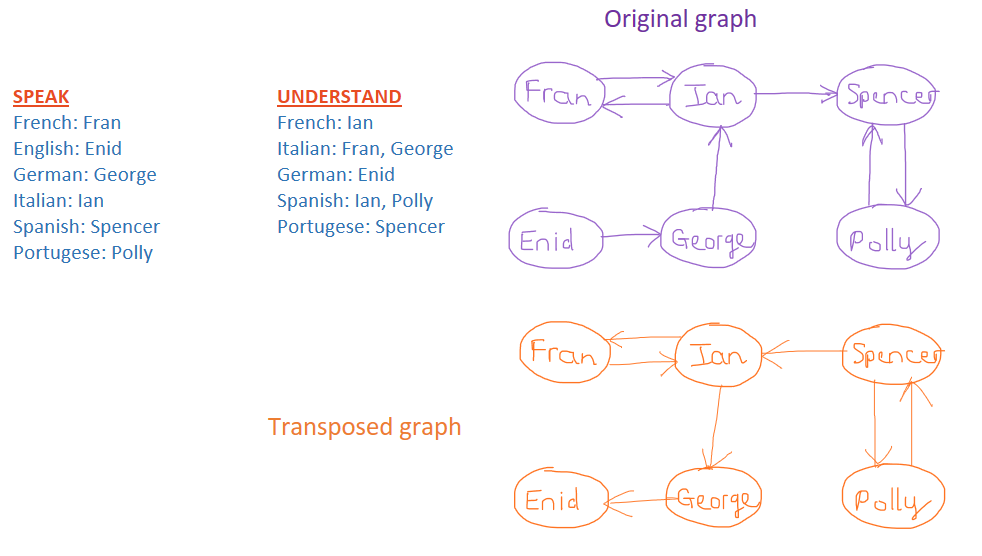

1. [Islands](https://open.kattis.com/problems/islands3){:target="_blank"}\
Breadth First Search. You can also solve it with Depth First Search or any graph traversal algorithms. \
Tip: mark each cell as visited for each up, down, left, right check to avoid duplicate cell in the queue.
```
    def bfs(image, visited, y, x):
        q = deque()
        q.append((x,y))

        while q:  
            (x,y) = q.popleft()
            # up
            if y - 1 >= 0 and not visited[y - 1][x] and image[y - 1][x] in ['L', 'C']:
                q.append((x, y-1))
                visited[y-1][x] = True

            # down
            if y + 1 < len(image) and not visited[y + 1][x] and image[y + 1][x] in ['L', 'C']:
                q.append((x, y+1))
                visited[y+1][x] = True

            # left
            if x - 1 >= 0 and not visited[y][x - 1] and image[y][x - 1] in ['L', 'C']:
                q.append((x-1, y))
                visited[y][x-1] = True

            # right
            if x + 1 < len(image[0]) and not visited[y][x + 1] and image[y][x + 1] in ['L', 'C']:
                q.append((x+1, y))
                visited[y][x+1] = True

    // create graph here ...

    // count islands
    visited = [[False for i in range(c)] for j in range(r)]
    count = 0
    for (x, y) in lands:
        if not visited[y][x]:
            bfs(image, visited, y, x)
            count += 1
```
2. [Cantina of Babel](https://open.kattis.com/problems/cantinaofbabel){:target="_blank"}\
Create 2 maps, languages people can speak and languages people can understand.
Build a directed graph by adding arrows from people who can speak a language to people who can understand the same language. Then create a transposed graph by reversing the arrows.
```
6
Fran French Italian
Enid English German
George German Italian
Ian Italian French Spanish
Spencer Spanish Portugese
Polly Portugese Spanish
```

We want to find the largest SCC. The result equals to the number of people subtract the number of people in the largest SCC. We will use Kosaraju algorithm.
```
    visited = set()
    graph: hashmap<name, list of names>
    transposed_graph: hashmap<name, list of names>
    stack = []

    function Kosaraju (start, transpose): // transpose: True or False
        visited.add(start)
        neighbours = transpose ? transposed_graph[start] : graph[start]
        for each n in neighbours:
            if n not in visited:
                Kosaraju(n, transpose)
        stack.append(start)

    // build graph, transposed graph here ....

    // find SCCs
    for name, neighbours in graph.items():
        if name not in visited:
            Kosaraju(name, False)

    visited.clear()
    while stack:
        u = stack.pop()
        if u not in visited:
            Kosaraju(u, True)
```
Notice that Kosaraju is just DFS.